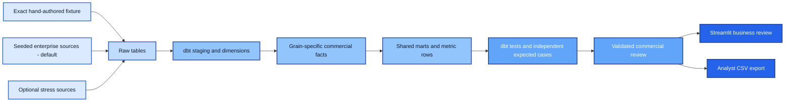

# Revenue Metrics Platform

**Marketing sees pipeline. Sales sees bookings. Finance sees invoices and cash. Why don't the numbers agree?**

This governed commercial analytics platform explains the differences through dimensional models, six shared metrics and two consumer paths. Its default demonstration is a deterministic synthetic B2B SaaS enterprise with approximately **CAD755M period-end ARR**. A separate hand-authored fixture supplies exact, independently checkable edge cases.

The established enterprise Q1 review produces **CAD197.46M in net bookings, CAD189.42M net invoiced and CAD174.61M allocated cash**. Period-end installed ARR is CAD754.39M; open pipeline is CAD222.34M. The mature 30-day current-quarter cohort win rate is 18.67%.

**Installed ARR ≠ quarterly bookings ≠ quarterly invoicing ≠ quarterly cash.** Customers acquired over 2020–2025 continue to contribute ARR. Only signed Q1 new business, renewals, expansions, upgrades, contractions and cancellations enter Q1 bookings. Billing continues for existing contracts; some collections settle opening invoices.

| Generated enterprise profile | Actual value |
|---|---:|
| Customer accounts | 60,000 |
| Opportunities, including retained acquisition/renewal history | 195,927 |
| Active core subscriptions at March 31 | 60,000 |
| Booking/amendment components | 345,504 |
| Signed Q1 commercial events behind those components | 28,792 |
| Invoice/credit lines, including supporting opening invoices | 775,133 |
| Payment allocations, including retained historical allocations | 329,053 |
| Period-end ARR | CAD754,389,953.40 |

33,834 active accounts have no Q1 booking. [Generated scale summary](docs/evidence/scale-summary.json) and [acquisition/renewal timeline](docs/evidence/business-timeline.json). Each signed event has twelve service-period commitment components; these are not twelve separately won deals. ARR emerges from dated contracts and explicit fees. Runtime-generated source rows stay outside GitHub and the delivery ZIP.

**All businesses, records and outcomes are synthetic.** The local DuckDB/dbt pipeline and Streamlit consumer execute. **Snowflake cloud execution is pending credentials:** the adapter, raw loader, role/grant SQL, isolated build schemas, consumer view and verification command are implemented, but local tests do not prove cloud behavior.

## See the commercial review

Read the [generated review and account-level discrepancy bridge](docs/evidence/commercial-review.md), inspect the [analyst export](docs/evidence/analyst-export.csv), or run the business app below. Both consumers use the same validated rows from `mart_metric_values`; the app contains no separate metric formulas.

## Architecture



The local target uses DuckDB. The Snowflake path loads the same sources, executes the same model graph and profile-appropriate validation, then verifies a read-only warehouse consumer and role denials. [Architecture and execution boundaries](docs/architecture.md).

## Fifteen models, explicit grains

| Model boundary | Grain and decision |
|---|---|
| `dim_account` | One effective interval per account; SCD2 region/owner changes use `[valid_from, valid_to)` |
| `dim_date` | One reporting day with month-end markers |
| Opportunity daily fact | One opportunity/day; received revisions rebuild the full affected opportunity history |
| Booking fact | One signed booking event; amendments remain signed deltas |
| Invoice fact | One invoice/credit line; credits retain their own event date |
| Payment fact | One payment allocation; a receipt is not duplicated across invoice lines |
| Subscription-period fact | One contract/month end; trial, one-time and ended contracts are excluded from ARR |
| Commercial marts | Independently aggregate facts before combining at account/date grain; never join raw financial facts many-to-many |

The remaining models are two staging views and six marts. [Model decisions](docs/architecture.md) and [generated dbt lineage](docs/evidence/dbt-lineage.json).

## Six governed metrics

| Metric | Time basis | Important qualification |
|---|---|---|
| Open pipeline | Period-end balance | Never sum daily snapshots |
| Net bookings | Booking/amendment event date | Contract commitment, not CRM pipeline or invoicing |
| Net invoiced | Invoice/credit line date | Not recognized revenue |
| Cash received | Payment allocation date | Allocated receipts only; not the bank balance |
| Period-end ARR | Month-end eligible contracts | Annualized recurring fees; not recognized revenue |
| Opportunity-cohort win rate | Creation cohort, 30-day window | Exclude immature opportunities; aggregate counts, not percentages |

[Metric contracts](metrics/catalog.json) specify owners, grains, permitted dimensions, filters, null behavior, additivity, versions and caveats. SQL implements the definitions; the JSON catalog documents them. There is no custom metric-expression framework. [Metric semantics](docs/metrics.md).

## Run locally

Use **Python 3.12**, from this repository directory:

```text
python -m venv .venv
```

Activate `.venv\Scripts\Activate.ps1` in Windows PowerShell, or `source .venv/bin/activate` on macOS/Linux. Then:

```text
python -m pip install -r requirements.lock
python -m pip install --no-deps --no-build-isolation -e .
revenue demo --profile enterprise --workspace .local/demo
python -m streamlit run app.py
```

Open the local URL printed by Streamlit. The demo loads sources, runs actual `dbt build`, checks dbt quality gates and enterprise scale/economic invariants, publishes a review and generates dbt docs. It refuses to overwrite an existing workspace: use a different workspace name for another run. To view another publication, set `REVENUE_PUBLICATION` to its `published` directory.

Use the exact fixture or generate the optional larger sources separately:

```text
revenue demo --profile fixture --workspace .local/fixture
revenue generate --profile stress --output .local/stress-sources
```

The optional stress profile uses 180,000 accounts and a multi-million-row source workload. It has not been executed in the delivered evidence; no stress timings or production capacity are claimed. [Source economics, profiles and measured local runs](docs/profiles.md).

Separate analyst consumption:

```text
revenue export --publication .local/demo/published --region ALL --output .local/analyst.csv
```

Supply `--expected-release <identifier>` to reject a stale consumer request. Enterprise regions are `ALL`, `East`, `North`, `West`, `EMEA` and `APAC`. The app also provides segment/offering selectors for the subscription-portfolio table; those selectors do not change the six region-filtered cards. The report window is intentionally Q1 2026; changing it requires compatible source/calendar coverage and a full rebuild, not editing the dashboard.

## Configure Snowflake

Follow [the Snowflake runbook](docs/snowflake.md), execute [bootstrap grants](snowflake/bootstrap.sql) as an appropriately privileged administrator, and set the variables documented in [.env.example](.env.example). Key files stay outside this repository.

```text
python scripts/verify_snowflake.py --require-cloud
```

With credentials this loads synthetic tables into the dedicated `REVENUE_METRICS_DEMO` database, runs dbt under `RMP_BUILD`, and exercises the `RMP_CONSUMER` role. **It replaces the demo RAW tables; never point this exercise at business data.** Without credentials it reports pending and exits nonzero when `--require-cloud` is used. [Current execution status](docs/evidence/snowflake-status.json).

## Failures and tests

```text
python scripts/verify.py
```

The verifier runs dependency/lint checks, Python/integration/Streamlit tests, real dbt builds, incremental versus clean-release comparison, definition-change evidence, generated docs and Markdown link checks. It uses a new isolated working directory each time.

The verifier regenerates enterprise sources twice and compares their file hashes, runs actual enterprise initial/incremental/full builds, checks model multiset signatures and exact publication equality, and exercises both consumer paths. Small-fixture tests retain exact full-row comparisons.

Tests cover fanout, SCD2 boundaries, amendments, credits, backdated corrections, obsolete snapshot removal, ratio rollups, immature cohorts, snapshot additivity, ARR eligibility, missing coverage, orphan accounts, metric versions, stale/tampered results, and failed transformation/promotion preserving the last validated release. [Scenario-to-test map](docs/testing.md).

## Generated evidence

- [Commercial review](docs/evidence/commercial-review.md) and [analyst export](docs/evidence/analyst-export.csv)
- [Enterprise corrections and discrepancy examples](docs/evidence/modeling-cases.json)
- [Exact fixture review](docs/evidence/fixture/commercial-review.md) and [fixture fanout cases](docs/evidence/fixture/modeling-cases.json)
- [Dataset manifest](docs/evidence/dataset-manifest.json), [scale summary](docs/evidence/scale-summary.json) and [measured local execution](docs/evidence/enterprise-verification.json)
- [ARR definition-change impact](docs/evidence/fixture/definition-change.json)
- [Executed dbt results](docs/evidence/dbt-results.json) and [lineage](docs/evidence/dbt-lineage.json)
- [Local verification](docs/evidence/verification.json) and [Snowflake status](docs/evidence/snowflake-status.json)

GitHub Actions workflows are included. A local verification result is **not** a claim that GitHub-hosted CI has run.

To create a clean upload ZIP after verification, run `python scripts/package.py`. The package manifest covers every delivered file except itself; the ZIP is reopened and every recorded hash is checked. Local databases, caches, virtual environments and credential files are excluded.

## Scope and limitations

This is a bounded commercial-modeling example, not an accounting system, CDP, ingestion framework or production benchmark. No GAAP/IFRS compliance, causal attribution or live CRM connector is claimed. Single currency, one reporting quarter, fixed customer identities and explicit source coverage keep the focus on model grains and business semantics.

The Streamlit app reads a validated release; it is not a live warehouse session. The Snowflake verifier separately exercises a real warehouse consumer when configured. Source coverage is supplied evidence, not an independent completeness guarantee. Local file integrity hashes detect changes but do not defend against a filesystem administrator. See [operating boundaries](docs/architecture.md).
